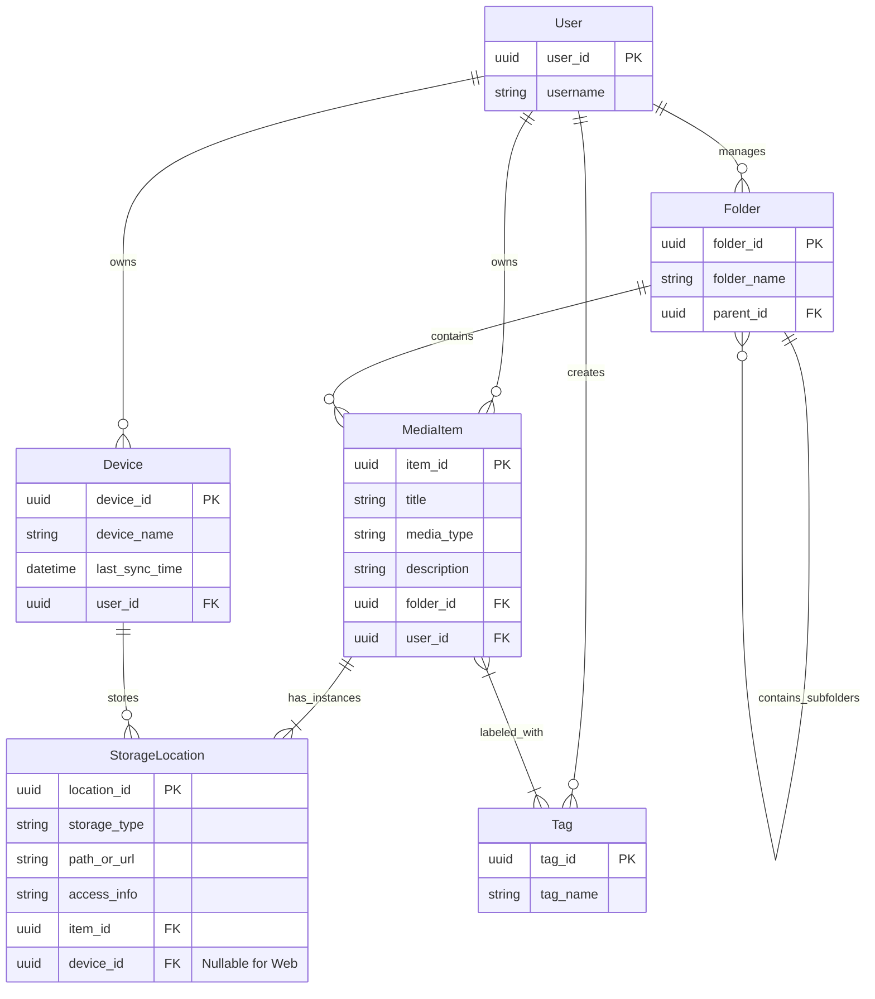

# 数据库项目设计文档 (二)：概念结构设计 (E-R图)

## 1. 设计概述
基于 MVP 需求分析，本阶段将系统需求转化为具体的实体与关系。设计重点在于支持**“单用户多设备”**的分布式存储模型，以及**“虚拟文件夹”**的整理逻辑。

## 2. 实体定义 (Entity Definitions)

### 2.1 核心实体

#### (1) 用户 (User)
*   **描述**：系统的使用者。虽然 MVP 仅支持单用户，但保留此实体以支持未来扩展（如多用户隔离）。
*   **关键属性**：
    *   `user_id` (唯一标识)
    *   `username` (用户名)
    *   `created_at` (注册时间)

#### (2) 设备 (Device)
*   **描述**：用户拥有的物理设备（如台式机、笔记本、手机）。
*   **关键属性**：
    *   `device_id` (唯一标识，UUID)
    *   `device_name` (设备名称，如 "My ThinkPad")
    *   `device_type` (类型：PC/Mobile/Tablet)
    *   `last_sync_time` (最后同步时间)

#### (3) 媒体项 (MediaItem)
*   **描述**：逻辑上的媒体资源单位。它代表一个“内容”，不绑定具体的物理路径。
*   **关键属性**：
    *   `item_id` (唯一标识)
    *   `title` (标题/文件名)
    *   `media_type` (类型：Video/Image/Doc/Web)
    *   `description` (备注/描述)
    *   `created_at` (创建时间)

#### (4) 存储位置 (StorageLocation)
*   **描述**：媒体项在具体物理世界中的位置。一个媒体项可以有多个存储位置（例如：在台式机上有本地文件，在笔记本上也有，或者是一个网络 URL）。
*   **关键属性**：
    *   `location_id` (唯一标识)
    *   `storage_type` (存储类型：Local/Web)
    *   `path` (绝对路径 或 URL)
    *   `access_info` (访问备注，如"需VPN"或"账号xxx")
    *   `is_available` (当前是否可用)

#### (5) 文件夹 (Folder)
*   **描述**：用于整理媒体项的虚拟容器，支持无限层级嵌套。
*   **关键属性**：
    *   `folder_id` (唯一标识)
    *   `folder_name` (文件夹名称)
    *   `parent_id` (父文件夹ID，支持层级)

#### (6) 标签 (Tag)
*   **描述**：用于灵活分类的标签。
*   **关键属性**：
    *   `tag_id` (唯一标识)
    *   `tag_name` (标签名)

---

## 3. 实体关系 (Relationships)

### 3.1 关系描述

1.  **用户 - 设备 (1:N)**
    *   一个用户可以拥有多个设备。
    *   一个设备属于一个用户。

2.  **用户 - 媒体项 (1:N)**
    *   一个用户拥有多个媒体项。

3.  **文件夹 - 文件夹 (1:N, 自关联)**
    *   一个文件夹可以包含多个子文件夹。
    *   一个子文件夹属于一个父文件夹。

4.  **文件夹 - 媒体项 (1:N)**
    *   一个文件夹可以包含多个媒体项。
    *   一个媒体项属于一个文件夹（类似文件系统逻辑）。

5.  **媒体项 - 存储位置 (1:N)**
    *   **核心设计**：一个媒体项（逻辑内容）可以对应多个存储位置（物理副本）。
    *   *例如*：电影《黑客帝国》是一个 `MediaItem`，它在台式机 `D:\Movies` 有一个 `StorageLocation`，在笔记本 `C:\Users\Movies` 也有一个 `StorageLocation`。

6.  **设备 - 存储位置 (1:N)**
    *   一个存储位置（如果是本地文件）必须依附于一个设备。
    *   *注*：如果是 Web URL 类型的存储位置，设备字段可为空。

7.  **媒体项 - 标签 (M:N)**
    *   一个媒体项可以打多个标签。
    *   一个标签可以关联多个媒体项。

8.  **用户 - 标签（1:N）**
    *   一个用户可以自定义多个标签。
    *   一个标签属于一个用户

9.  **用户 - 文件夹（1:N）**
    *   一个用户可以自定义多个文件夹。
    *   一个文件夹属于一个用户。
---

## 4. E-R 图 (Mermaid)

---

## 5. 关键设计决策说明

### 5.1 为什么拆分 MediaItem 和 StorageLocation？
这是支持**“单用户多设备”**和**“混合存储”**的关键。
*   **传统设计**：在 `MediaItem` 表中直接存 `file_path`。
    *   *问题*：如果用户有两台电脑，文件路径不同（D盘 vs C盘），或者文件移动了，就很难管理。
*   **本项目设计**：
    *   `MediaItem` 代表“这个资源是什么”（如：课程视频）。
    *   `StorageLocation` 代表“它在哪里”（如：台式机D盘、B站链接）。
    *   这样设计允许同一个资源在不同设备上有不同的路径，或者同时拥有本地副本和网络链接。

### 5.2 虚拟文件夹 (Virtual Folder) vs 物理文件夹
我们选择了**虚拟文件夹**设计。
*   数据库中的 `Folder` 结构完全独立于硬盘上的物理文件夹结构。
*   **优势**：用户可以按照自己的逻辑（如“学习/娱乐”）整理资源，而不需要移动硬盘上的实际文件，避免破坏其他软件的文件关联。

### 5.3 标签 (Tag) 的 M:N 设计
为了提供比文件夹更灵活的分类维度，采用了多对多关系。需要引入一个中间表（在逻辑设计阶段体现）来实现 `MediaItem` 和 `Tag` 的关联。
