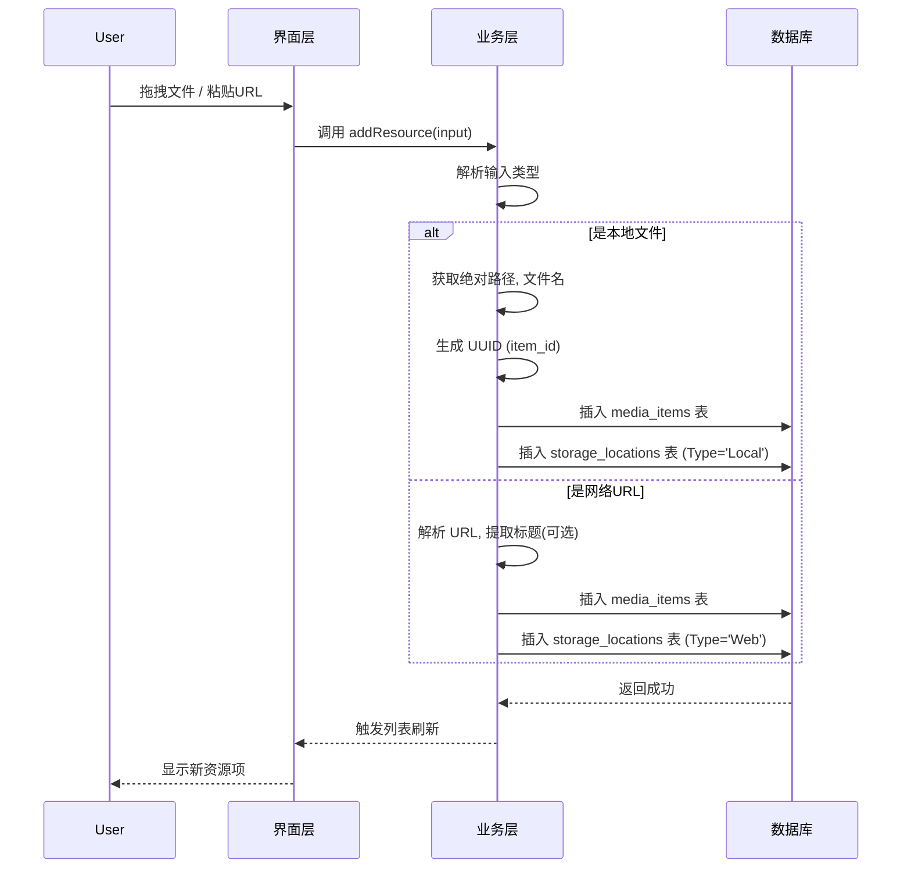
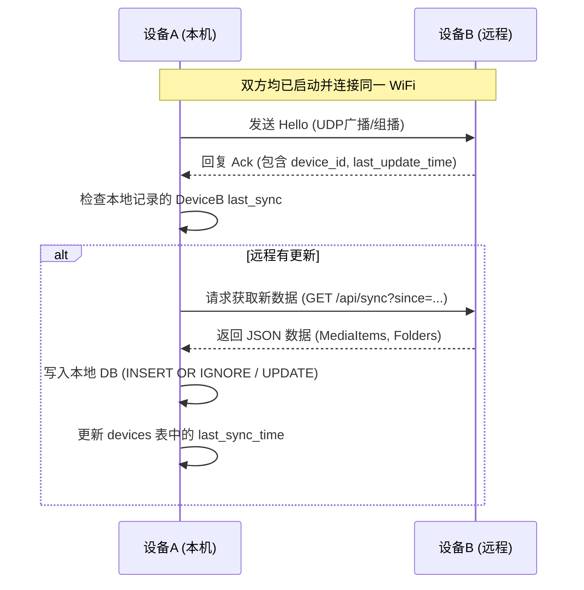

# 数据库项目设计文档 (五)：应用系统设计

## 1. 概要设计 (High-Level Design)

### 1.1 系统架构模式
本项目采用 **Local-First (本地优先)** 的桌面客户端架构，结合 **P2P (点对点)** 同步机制。
*   **本地优先**：每个设备都拥有完整的应用程序和 SQLite 数据库副本，断网状态下依然可以进行完整的增删改查操作。
*   **去中心化同步**：设备间通过局域网 (LAN) 直接通信以同步元数据，无需依赖中心服务器，符合 MVP 低成本、高隐私的需求。

### 1.2 技术栈选型 (Tech Stack)
*   **应用框架**：**Electron**
    *   *理由*：使用 Web 技术 (HTML/CSS/JS) 开发界面，开发效率高，且能直接调用 Node.js API 操作本地文件系统（读取文件、计算 Hash）。
*   **前端视图**：**React** + **Material UI**
    *   *理由*：组件化开发，适合构建复杂的管理界面（如文件夹树、资源列表），Material UI 提供现成的美观组件。
*   **数据存储**：**SQLite 3** (使用 `better-sqlite3` 或 `sqlite3` 库)
    *   *理由*：嵌入式数据库标准，无需安装服务，单文件存储，性能优异。
*   **网络通信**：**Node.js HTTP / WebSocket**
    *   *理由*：在应用内启动轻量级 HTTP 服务，用于局域网内设备发现和 JSON 数据交换。

### 1.3 模块划分 (Module Structure)
系统遵循经典的分层架构设计：

1.  **表现层 (Presentation Layer)**:
    *   负责 UI 渲染和用户交互。
    *   **核心组件**：`ResourceList` (资源列表), `FolderTree` (文件夹树), `DetailPanel` (详情面板), `SyncStatus` (同步状态)。
2.  **业务逻辑层 (Business Logic Layer)**:
    *   处理核心业务规则，连接 UI 与数据库。
    *   **MediaService**: 处理资源的导入、整理、去重逻辑。
    *   **SyncService**: 处理设备发现 (Bonjour/mDNS)、元数据比对、差异拉取。
    *   **FileService**: 处理本地文件系统的扫描、路径存在性检查。
3.  **数据访问层 (Data Access Layer)**:
    *   封装 SQL 操作，提供对象化的数据接口。
    *   **DatabaseManager**: 负责数据库连接、初始化建表。
    *   **DAO (Data Access Objects)**: `MediaDAO`, `FolderDAO`, `DeviceDAO`。

## 2. 详细设计 (Detailed Design)

### 2.1 核心业务流程

#### (1) 资源录入流程 (Add Resource)
用户拖拽文件或粘贴 URL 到应用中。

#### (2) 局域网同步流程 (Sync)
设备 A (本机) 发现 设备 B (远程) 并同步元数据。

### 2.2 核心接口定义 (Interface Definitions)

#### `MediaService`
*   `addLocalFile(filePath: string, folderId?: string): Promise<MediaItem>`
    *   功能：导入本地文件，自动提取文件名作为标题。
*   `addWebLink(url: string, title: string, description?: string): Promise<MediaItem>`
    *   功能：保存网络链接。
*   `moveToFolder(itemIds: string[], targetFolderId: string): Promise<void>`
    *   功能：移动资源到虚拟文件夹。

#### `SyncService`
*   `startDiscovery(): void`
    *   功能：启动局域网设备发现服务。
*   `syncWithDevice(targetIp: string): Promise<SyncResult>`
    *   功能：主动触发与指定 IP 设备的同步。

### 2.3 界面原型设计 (UI Prototype)

#### (1) 主界面布局
*   **左侧边栏 (Sidebar)**:
    *   **库 (Library)**: "所有项目", "最近添加", "Web资源", "本地文件".
    *   **文件夹 (Folders)**: 树形结构的虚拟文件夹导航，支持右键新建/重命名。
    *   **设备 (Devices)**: 显示已配对设备列表及在线状态 (🟢/⚪)。
*   **中间内容区 (Main Content)**:
    *   **顶部工具栏**: 搜索框 + 搜索作用域 (Scope) + 可视化筛选条 (Chips), 排序按钮, 视图切换.
        *   **Scope 下拉**：搜索框左侧提供范围选择：`全部 / 当前文件夹 / 本地 / 网页 / 某设备`，用于明确检索范围。
        *   **Chips 筛选条**：支持结构化语法并自动转为可删除条件标签，支持 `tag:`、`type:`、`device:`、`folder:`、`date:`。
            *   示例：`tag:旅行 type:Doc date:2025-12-01..2025-12-31`
    *   **列表区**: 表格或网格展示。列包含：图标、标题、大小、标签、所在位置(Local/Web).
*   **右侧详情栏 (Inspector)**:
    *   选中项目的详细信息：预览图、完整路径/URL (支持点击打开)、备注编辑区、标签管理。

#### (2) 资源录入弹窗
*   **类型切换**: [本地文件] / [网络链接]
*   **表单项**:
    *   **源**: 文件路径选择器 或 URL 输入框。
    *   **标题**: 默认文件名，可手动修改。
    *   **位置**: 下拉树选择所属虚拟文件夹。
    *   **标签**: 输入框 + 历史标签自动补全。
    *   **备注**: 多行文本域，用于记录账号信息等。
